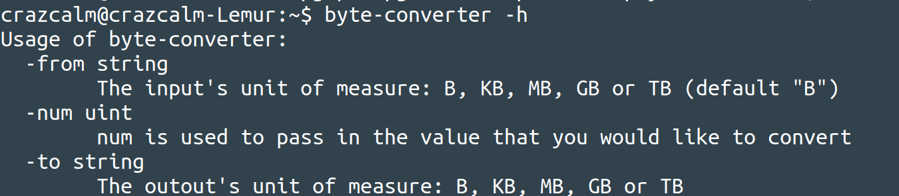

# byte-converter

A command line app to convert Bytes to Kilo/Mega/Giga/Tera--Bytes

## Install
	go get github.com/crazcalm/byte-converter

cd into the directory and then run:

	go build

## Interface

	